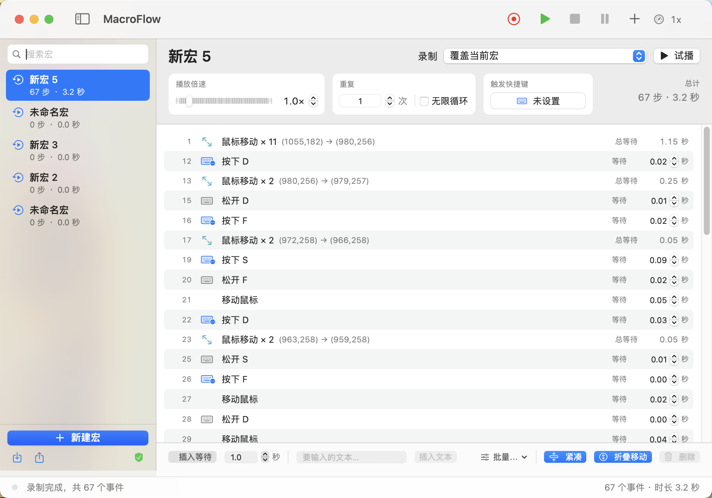
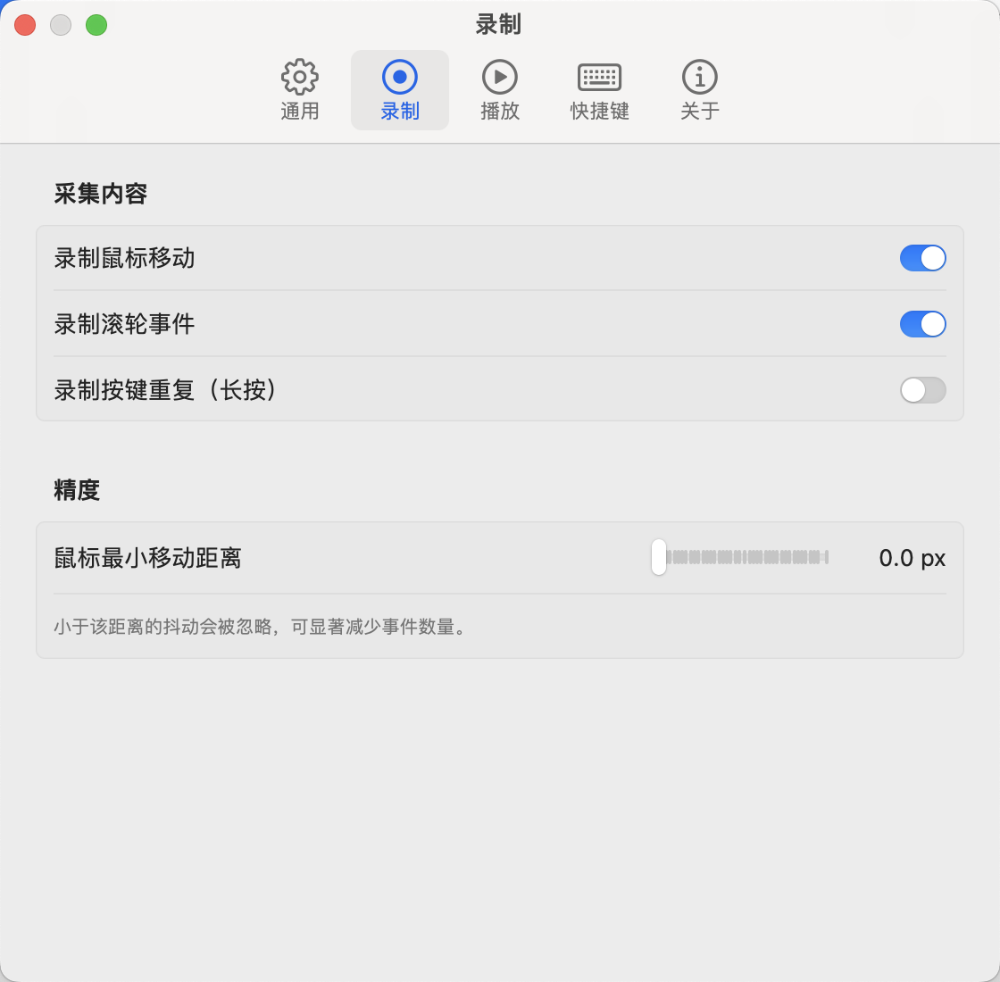
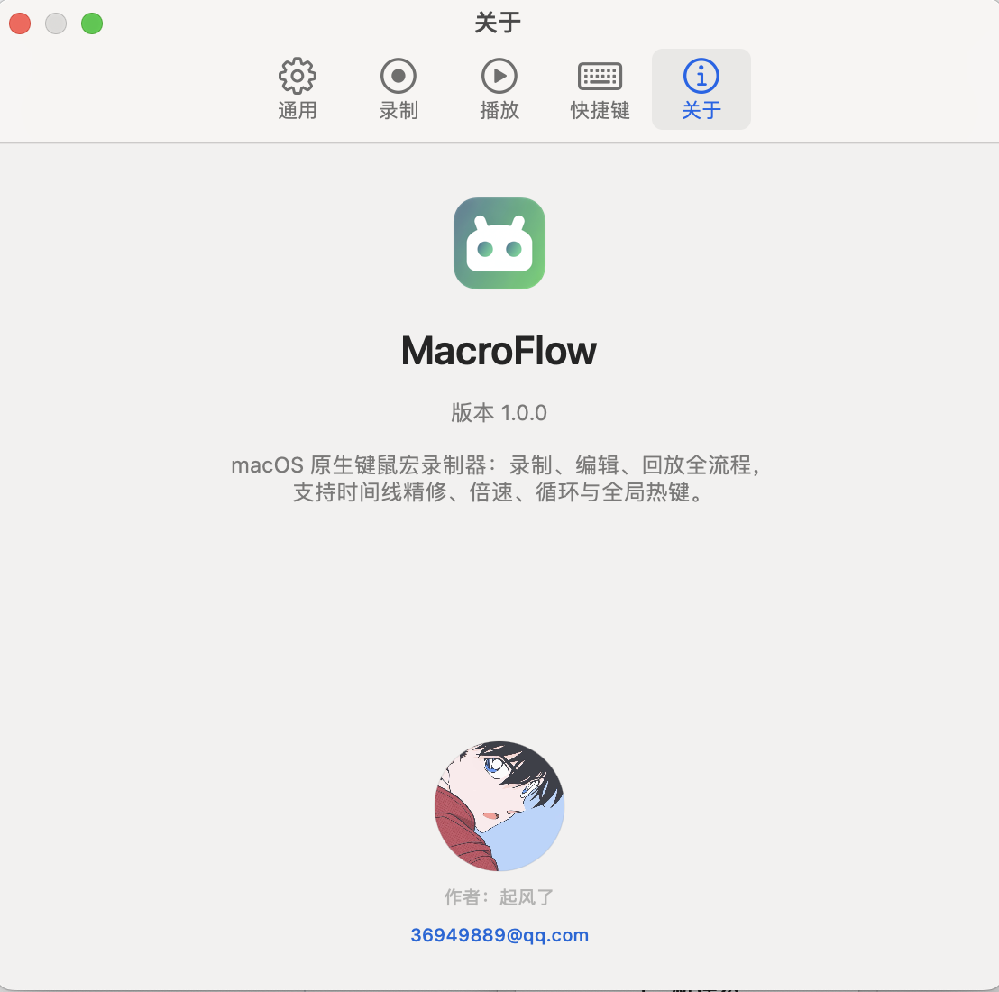

# MacroFlow 使用说明

<p align="center">
  
</p>

> 录一遍操作，之后交给它重复。（自己用mac电脑没找到类似好用的软件，所以自己写了一个）

---

## 一、这是什么

MacroFlow 会记录你在任意软件里的键盘和鼠标操作，存成一个「宏」，之后可以按你设定的倍速、次数反复回放。

适合这些场景：
- 每天要重复点十几下的表单录入
- 需要反复执行的软件操作流程
- 批量截图、批量改设置这类机械操作
- 定时在某个软件里做固定动作

---

## 二、系统要求

| 项目 | 最低要求 |
| --- | --- |
| 操作系统 | **macOS 12 Monterey** 或更高版本 |
| 处理器 | Apple Silicon 或 Intel（Universal 二进制） |
| 内存 | 建议 4 GB 及以上 |
| 磁盘空间 | 约 50 MB 可用空间 |
| 必要权限 | 辅助功能、输入监控（见下文） |

---

## 三、装好之后先做两件事

### 1. 允许打开（只需一次）

因为是自签名应用、没有经过 Apple 公证，首次打开时系统 Gatekeeper 安全机制会拦截，**这不是文件损坏**：

> ✅️ 进阶：全局开启「允许任何来源」（适合频繁测试，**会降低系统全局安全防护，用完建议恢复**）
> 1. 打开「终端」，执行命令：
> ```bash
> sudo spctl --master-disable
> ```
> 2. 输入电脑管理员密码（输入时屏幕不显示字符，属于正常现象）
> 3. 回到 `系统设置 → 隐私与安全性`，即可看到「任何来源」选项

> 如果提示「应用已损坏，无法打开」，执行下面命令清除隔离标记：
> ```bash
> xattr -rd com.apple.quarantine /Applications/MacroFlow.app
> ```

### 2. 授权（不授权完全用不了）

这两项权限缺一不可：

| 权限 | 在哪开 | 缺了会怎样 |
| --- | --- | --- |
| 辅助功能 | 系统设置 → 隐私与安全性 → 辅助功能 | 无法回放（播放没反应） |
| 输入监控 | 系统设置 → 隐私与安全性 → 输入监控 | 无法录制（录不到任何操作） |

在列表里点 `+` 或把应用拖进去勾选即可。**列表里没出现本应用时**，先完全退出（⌘Q）再打开一次就会出现。勾选后需要重启应用才生效。

授权状态在左下角有指示灯：绿色对勾 = 就绪，橙色盾牌 = 还缺权限，点它可以快速跳转。

---

## 四、界面速览



- **左侧边栏**：所有宏，点一下切换。支持搜索、右键复制 / 导出 / 删除。
- **顶部工具栏**：录制（红）、播放（绿）、停止、暂停、新建宏。
- **右侧上方面板**：倍速、重复次数、触发快捷键。
- **右侧下方时间线**：录制到的每一个步骤，可编辑。
- **底部状态栏**：当前状态与宏的统计信息。
- **菜单栏图标**（屏幕右上角）：不用打开主窗口也能录制 / 播放。

---

## 五、完整走一遍

### 1. 新建宏

点工具栏 `+`，或按 `⌘N`，左侧会出现一个新宏。

### 2. 录制

点红色 **录制** 按钮（或按 `⌘R`；App 在后台时用全局热键 `⌘⇧A`）。

开始后本软件会自动退到后台，把屏幕让给你要操作的软件 —— 这样就不会把操作本软件自己的动作录进去。

屏幕顶部会出现一条悬浮控制条，可以拖到任意位置，上面有**停止**按钮和快捷键提示。

> **录制模式**（名称右边下拉框）：
> - **覆盖当前宏**：清掉原有步骤重新录
> - **追加到末尾**：保留原步骤，新操作接在后面

### 3. 停止录制

点悬浮条上的**停止**，或按 `⌘⇧A` / `⌘R`。

### 4. 检查与编辑

时间线里能看到每一步。常见调整：

- **删掉多余步骤**：选中一行（⌘ 点选多行、⇧ 点选连续多行），点右下角**删除选中**
- **改等待时间**：双击某一步的延时数字直接改
- **插入等待**：选中某步后按 `⌘⇧D` 插入 1 秒等待
- **步骤太多看不过来**：打开右下角的 **紧凑**（行高更小）和 **折叠移动**（连续鼠标移动合并成一行）。注意这俩只是显示方式，不会改动真实步骤。

### 5. 试播

点 **试播**：只跑一遍，不管你设了几百次重复还是无限循环。用它验证单轮流程对不对。

### 6. 正式播放

点绿色 **播放**（或 `⌘P`；后台时用 `⌘⇧R`）。按设定的倍速和次数跑。

- 播放中按 `Esc` 立即停止
- 需要中途停下看看：点 **暂停**，再点 **继续**

---

## 六、常用设置



### 单个宏的设置（右侧上方）

| 项目 | 说明 |
| --- | --- |
| 播放倍速 | 0.1× – 8×，慢放用于调试，快放用于省时间 |
| 重复 | 1 – 999 次；也可勾选**无限循环**一直跑到你按 Esc |
| 触发快捷键 | 给这个宏绑一个专属组合键，之后不用打开软件，按下即播 |

### 软件设置（⌘, 或菜单栏 → 设置）

- **外观**：主题风格，跟随系统 / 浅色 / 深色
- **通用**：开始录制或播放时是否自动退到后台、是否显示悬浮控制条、结束后是否切回本软件、开机自启
- **录制**：是否记录鼠标移动、滚轮、按键重复；鼠标最小移动距离（数值越大步骤越少）
- **播放**：是否平滑鼠标轨迹、是否加随机抖动让操作更像真人、结束后是否还原鼠标位置
- **快捷键**：全局热键，默认 `⌘⇧A` 录制、`⌘⇧R` 播放 / 停止

---

## 七、快捷键

### 全局热键（软件在后台也能用）

| 快捷键 | 作用 |
| --- | --- |
| `⌘⇧A` | 开始 / 停止录制 |
| `⌘⇧R` | 开始 / 停止播放 |

### 应用内快捷键

| 快捷键 | 作用 |
| --- | --- |
| `⌘N` | 新建宏 |
| `⌘R` | 开始 / 停止录制 |
| `⌘P` | 开始 / 停止播放 |
| `⌘.` | 暂停 / 继续 |
| `⌘⇧D` | 插入 1 秒等待 |
| `⌃⌘S` | 显示 / 隐藏边栏 |
| `⌘,` | 打开设置 |
| `Esc` | 停止播放 |

---

## 八、备份与迁移

- **导出**：选中宏 → 左侧下方 `↓` 图标 → 存成 `.json` 文件
- **导入**：左侧下方 `↑` 图标 → 选择 `.json` 文件

换电脑时把 JSON 拷过去导入即可。宏数据本身存在 `~/Library/Application Support/MacroFlow`。

---

## 九、遇到问题先看这里

**录不到任何操作**
→ 缺「输入监控」权限。去系统设置勾选，然后**完全退出应用再打开**。

**播放没反应**
→ 缺「辅助功能」权限。同上。

**系统设置的权限列表里找不到本应用**
→ 先 ⌘Q 完全退出，再打开一次，条目就会出现。也可以点左下角橙色盾牌，或在设置里点「权限设置」跳转。

**录出来步骤特别多（几千步）**
→ 鼠标移动采样太密。设置 → 录制 → 把「鼠标最小移动距离」调大（比如 8–15 px），或关掉「录制鼠标移动」。已有的老宏可以用时间线底部的**折叠移动**让视图变清爽。

**回放时鼠标跑到别的地方去了**
→ 回放是按录制时的屏幕坐标走的。换显示器、改分辨率或改变了窗口位置都可能对不上，建议在同一套屏幕布局下使用。

**播放停不下来**
→ 按 `Esc`，或点悬浮控制条上的停止。

**提示「应用已损坏，无法打开」**
→ 执行终端命令清除隔离标记：`xattr -rd com.apple.quarantine /Applications/MacroFlow.app`

---

## 十、联系与反馈

<p align="center">
  
</p>

- 作者：起风了
- 邮箱：36949889@qq.com

遇到问题欢迎邮件反馈，附上「系统版本 + 具体操作步骤」会更快定位。
